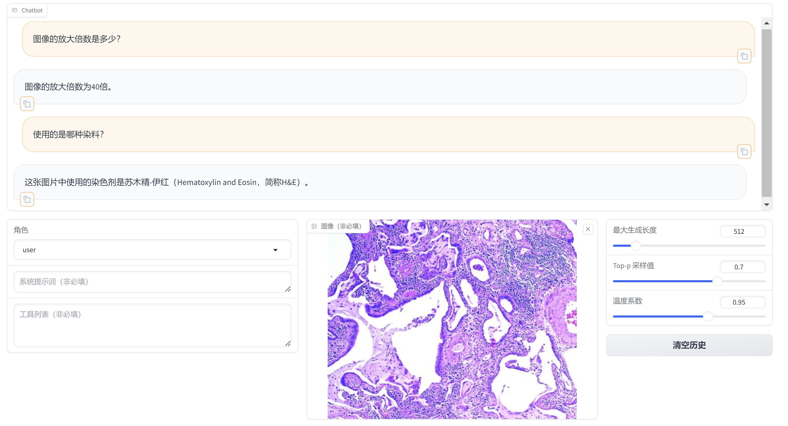
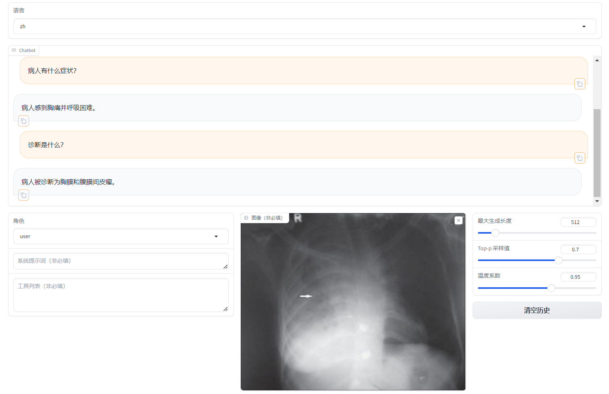
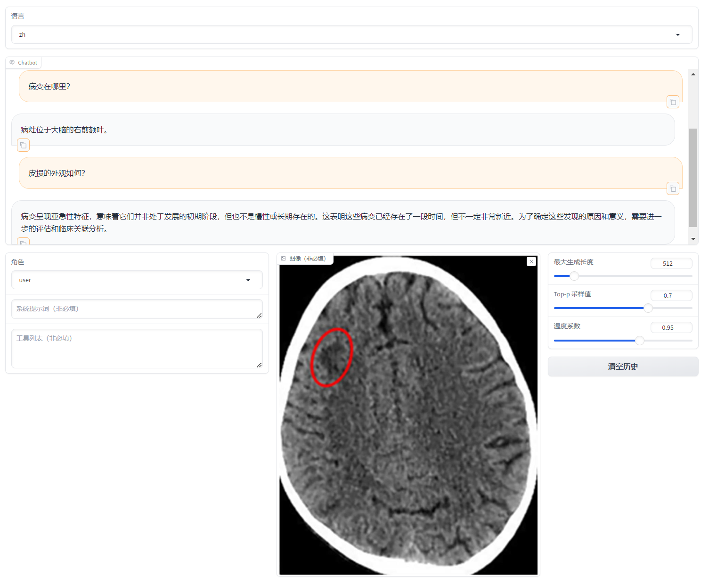

# Chinese-LLaVA-Med

## Benchmark

|                            Method                            | [llava-med-zh-eval](https://huggingface.co/datasets/BUAADreamer/llava-med-zh-eval) Qwen Score |
| :----------------------------------------------------------: | :----------------------------------------------------------: |
|                      GPT4 Ground Truth                       |                            68.26                             |
| [LLaVA-1.5-7B](https://huggingface.co/llava-hf/llava-1.5-7b-hf) |                            53.13                             |
| [Chinese-LLaVA-Med-7B](https://huggingface.co/BUAADreamer/Chinese-LLaVA-Med-7B) |                          **58.78**                           |

## Demo

<details><summary>分析组织切片</summary>



</details>

<details><summary>分析胸片</summary>



</details>

<details><summary>分析CT</summary>



</details>

## Training your own Medical MLLM

### Dataset

|                           Dataset                            |         Description         |
| :----------------------------------------------------------: | :-------------------------: |
| [llava-med-zh-instruct-60k](https://huggingface.co/datasets/BUAADreamer/llava-med-zh-instruct-60k) | 60k instruction tuning data |
| [llava-med-zh-eval](https://huggingface.co/datasets/BUAADreamer/llava-med-zh-eval) |     115 evaluation data     |

### Environment

```shell
# install LLaMA-Factory
git clone https://github.com/hiyouga/LLaMA-Factory.git
cd LLaMA-Factory
pip install -e .[torch,metrics]
```

### Finetuning

We recommend using `full` finetuning, but you could also use `lora` yaml.

```shell
# full finetuning
CUDA_VISIBLE_DEVICES=0,1 python -m torch.distributed.run \
    --nproc_per_node 2 \
    --nnodes 1 \
    --standalone \
    ../LLaMA-Factory/src/train.py config/llava1_5_full_sft.yaml

# export
# modify your own export_hub_model_id and hf_hub_token in the config/llava1_5_full_sft_export.yaml
CUDA_VISIBLE_DEVICES=0 llamafactory-cli export config/llava1_5_full_sft_export.yaml
```

### Evaluation

```shell
# generate output results
python3 evaluation/generate_eval_content.py --model_name_or_path models/llava1_5-7b-med

# eval by qwen-1.5-14b-chat
python3 evaluation/eval_qwen_score.py --input_path outputs/llava_med_zh_eval_llava1_5-7b-med.json
```

### Inference

```shell
# with final model
llamafactory-cli webchat config/llava1_5_full_sft_infer.yaml
```

